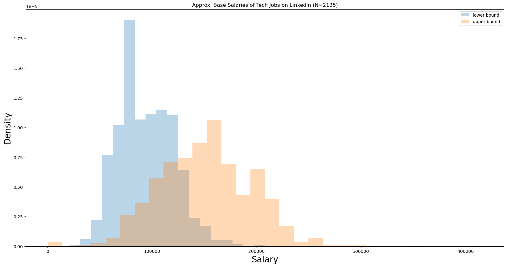
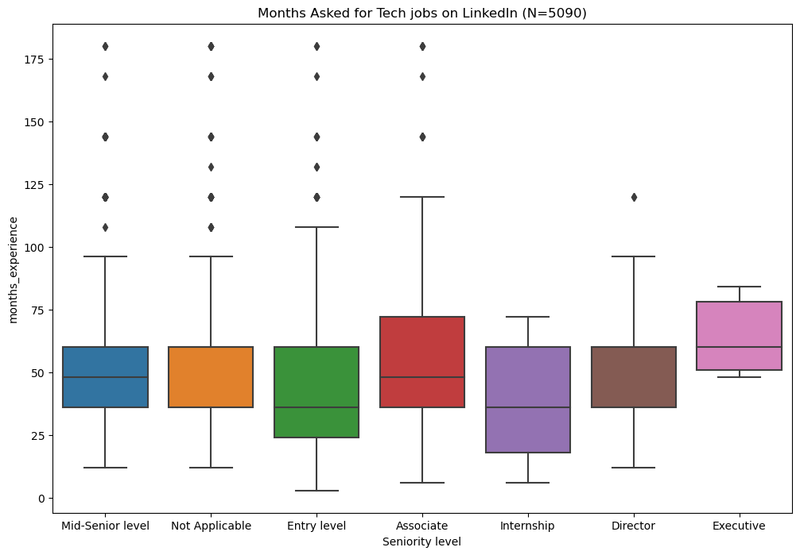

# LinkedIn Tech Job Data
 A compilation of job posts and metadata scraped from various tech categories on LinkedIn

## About the data

### Example Rows from [jobs.csv](jobs.csv) 

| Employment type | Industries | Job function| Seniority level  | company | company\_id  | context   | date | description | education | location | months\_experience  | post\_id  | post\_url  | sal\_high | sal\_low | salary  | title |
|---|---|---|---|---|---|---|---|---|---|---|---|---|---|---|---|---|---|
| Full-time | Broadcast Media | Information Technology | Mid-Senior level | CyberCoders  | 21836\.0  | {"@context": "http://schema.org", "@type": "JobPosting", "datePosted": "2021-07-09T17:39:28.000Z", "description": "Job Title: Senior Data Engineer Location: Alexandria, VA Salary Range: $120k - $150k Requir...      | NaN  | Job Title: Senior Data Engineer Location: Alexandria, VA Salary Range: $120k - $150k Requir... | bachelor degree  | Alexandria, VA | 60\.0 | 2632814552 | https://www.linkedin.com/jobs/view/senior-data-engineer-at-cybercoders-2632814552  | NaN | NaN  | NaN  | Senior Data Engineer|
| Full-time | Hospital & Health Care, Medical Devices, and Pharmaceuticals | Engineering and Information Technology | Not Applicable       | Johnson & Johnson          | 1207\.0    | {"@context": "http://schema.org", "@type": "JobPosting", "datePosted": "2021-07-09T17:39:11.000Z", "description": "Ethicon, part of Johnson &amp; Johnson Medical Devices Companies, is recruiting for a ... | NaN | Ethicon, part of Johnson & Johnson Medical Devices Companies, is recruiting for a ...  | bachelor degree  | Santa Clara, CA   | 96\.0  | 2632810866  | https://www.linkedin.com/jobs/view/principal-full-stack-software-engineer-at-johnson-johnson-2632810866 | NaN | NaN | NaN | Principal Full Stack Software Engineer. |

### Top job titles

### Top companies

### Salary Data 

Only a fraction of the posts contain salary metadata. 
The salary data here is likely skewed because of this, and will become outdated more with time due to inflation and other factors. 
For now, though, the data is interesting!

### Years of Experience

Not all the metadata is reliable. 
One trend that stands out is the amount of experience needed for a role. 
No matter the job seniority level, the distribution of experience asked is consistently in the same range. 
This suggests that experience ranges aren't taken seriously by job posters, at least when LinkedIn asks for it. 
The actual range is much more likely to be reflected in the job description.

